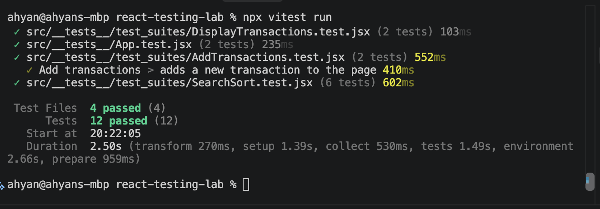

# The Royal Bank of Flatiron

A React banking app for tracking expenses. You can view your transactions, add new ones, search them by description, and sort them by description or category. The app has a Vitest test suite covering each of these features.

## Features

- Transactions load from the backend when the page opens
- Add a transaction with a date, description, category and amount
- Search transactions by description (not case sensitive)
- Sort transactions by description or category

## Setup

1. Fork and clone this repository
2. Install dependencies:

```
npm install
```

3. Start the backend (runs on port 6001):

```
npm run server
```

4. In a second terminal, start the app:

```
npm run dev
```

Open the local URL that Vite prints in the terminal.

## Running the tests

```
npm test
```

The tests mock `fetch`, so you don't need the backend running to run them.

| File | What it tests |
| --- | --- |
| `DisplayTransactions.test.jsx` | Transactions are fetched and shown on startup |
| `AddTransactions.test.jsx` | A new transaction appears on the page and the POST request is sent |
| `SearchSort.test.jsx` | Search filtering, case handling, and sorting by description and category |
| `App.test.jsx` | The app renders its heading, search box and add button |



## Bugs fixed while adding tests

- Search text was stored in state but never used, so the search box did nothing. `AccountContainer` now filters the list.
- The sort dropdown called an empty `onSort` function. It now sorts the list.
- `AddTransactionForm` read inputs with `e.target.date.value`, which fails in the test environment. It now uses `e.target.elements`.

## Tech

React, Vite, Vitest, React Testing Library, json-server